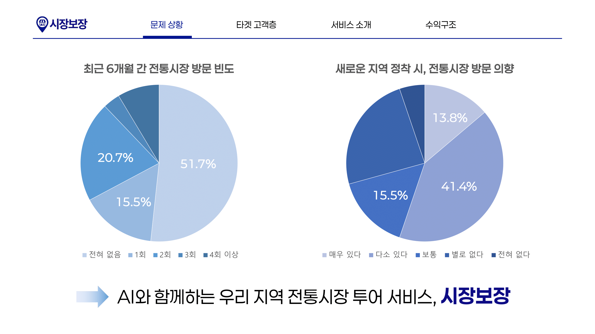
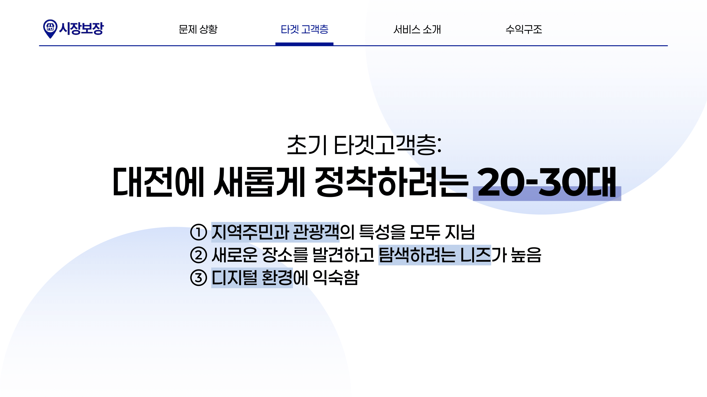
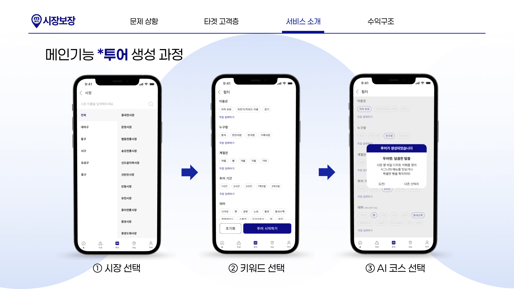
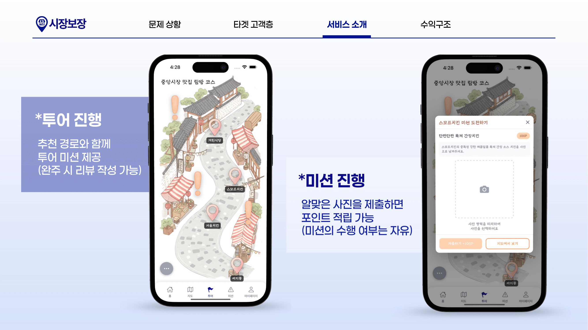
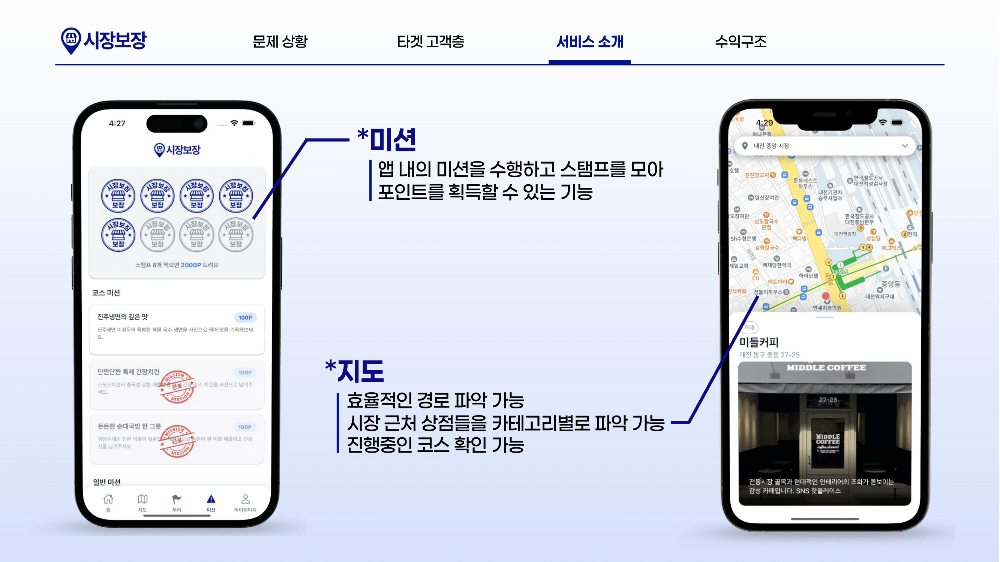
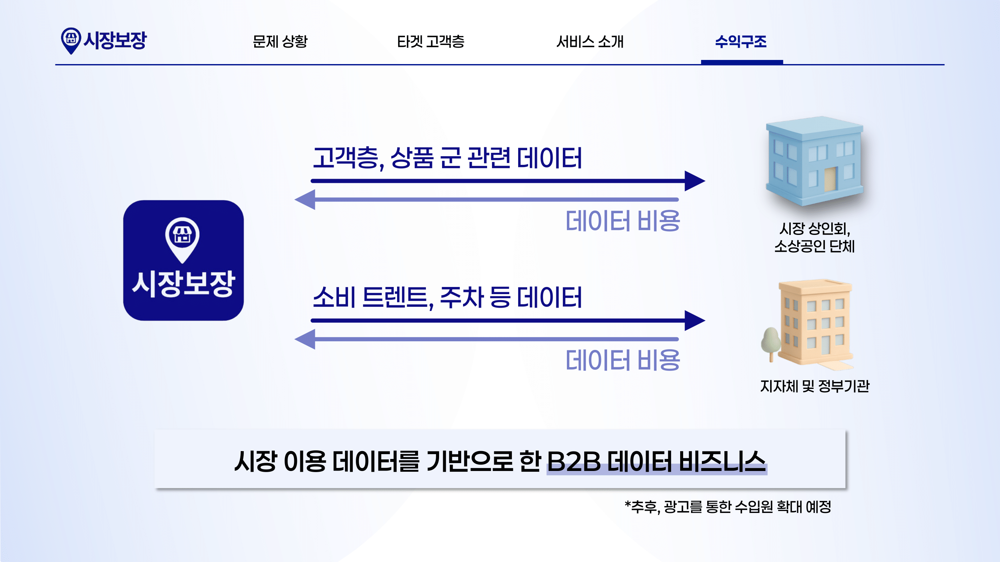

# 👋 안녕하세요! 저는 이민철입니다

## 🎯 About Me

안녕하세요! 저는 풀스택 개발에 열정을 가진 개발자입니다.
멋쟁이사자처럼 13기 충남대 3조에서 시장보장(Sijang-bojang) 프로젝트를 진행했습니다.
AI 기반 코스 추천과 미션 시스템을 통해 전통시장을 더 재미있게 탐험할 수 있는 모바일 앱을 개발했습니다.

## 👥 팀 정보

**TEAM\_충남대학교 3고초려** (5명)

| **PM** 이은혜       | **PM** 이나연       | [**FE** 이민철](https://github.com/als8921) | [**BE** 엄태은](https://github.com/EomTeaEun) | [**BE** 이예은](https://github.com/lye5615) |
| ------------------- | ------------------- | ------------------------------------------- | --------------------------------------------- | ------------------------------------------- |
| 프로젝트 관리, 기획 | 프로젝트 관리, 기획 | 프론트엔드 개발                             | 백엔드 개발                                   | 백엔드 개발                                 |

## 🛠️ 기술 스택

### Frontend

### Backend

### Database

### AI & Cloud

### Tools & Others

## 📁 프로젝트

### 1. 시장보장 (Sijang-bojang) - 전통시장 투어 가이드 앱

**팀:** TEAM\_충남대학교 3고초려 (5명)  
**역할:** 프론트엔드 개발  
**기술 스택:** React Native, TypeScript, Tailwind CSS, Spring Boot, MySQL, OpenAI API  
**설명:** 대전 전통시장을 활용한 모바일 투어 가이드 앱으로, AI 기반 코스 추천과 미션 완료를 통해 사용자가 전통시장을 더 재미있고 의미있게 탐험할 수 있도록 도와주는 서비스입니다.

#### 📊 프로젝트 배경 및 타겟 고객

전통시장 방문 빈도와 방문 의향에 대한 조사 결과를 바탕으로, **20-30대**를 주요 타겟으로 설정했습니다:

- 📈 **전통시장 방문률 증가 필요성**: 51.7%가 전혀 방문하지 않는 상황
- 🎯 **방문 의향은 높음**: 56.9%가 방문 의향 보유
- 💡 **디지털 네이티브**: 새로운 장소 발견에 대한 니즈가 높음

**초기 타겟고객: 대전에 새롭게 정착하려는 20-30대**

- ① 지역주민과 관광객의 특성을 모두 지님
- ② 새로운 장소를 발견하고 탐색하려는 니즈가 높음
- ③ 디지털 환경에 익숙함

#### 🎯 핵심 기능 소개

**메인기능 \*투어 생성 과정**

1. **시장 선택**: 대전 지역 전통시장 목록에서 선택
2. **키워드 선택**: 사용자의 취향과 상황에 맞는 태그 선택
3. **AI 코스 선택**: OpenAI API를 활용한 맞춤형 코스 추천

**투어 진행**

- **투어 진행**: 추천 경로와 함께 투어 미션 제공 (위주 시 리뷰 작성 기능)
- **미션 진행**: 알맞은 사진을 제출하면 포인트 적립 가능 (미션의 수행 여부는 자유)

**미션 시스템 & 지도 연동**

- **미션**: 앱 내의 미션을 수행하고 스탬프를 모아 포인트를 획득할 수 있는 기능
- **지도**: 효율적인 경로 파악 가능, 시장 근처 상점들을 카테고리별로 파악 가능한 친화적인 코스 확인 가능

#### 🚀 비즈니스 모델

**시장 이용 데이터를 기반으로 한 B2B 데이터 비즈니스**

- **고객층, 상품 군 관련 데이터** → 시장 상인회, 소상공인 단체
- **소비 트렌드, 주차 등 데이터** → 지자체 및 정부기관

#### 📱 완성된 서비스

**"나만의 코스로, 시장 구석구석 누버보장!"**

- 🎯 **개인화된 투어 경험**: AI 기반 맞춤형 코스 추천
- 🎮 **게임화된 탐험**: 미션과 스탬프 수집을 통한 재미있는 시장 탐방
- 📍 **정확한 위치 기반 서비스**: 실시간 경로 안내 및 주변 정보 제공

**주요 기능:**

- 🗺️ **AI 코스 추천**: 사용자 선호도에 따른 맞춤형 코스 생성
- 🎯 **미션 시스템**: 방문형/비방문형 미션으로 게임화된 투어 경험
- 📍 **실시간 위치 서비스**: Kakao Maps API를 활용한 정확한 위치 기반 서비스
- 🏆 **스탬프 투어**: 코스 완료 시 자동 스탬프 수집 시스템
- 📊 **진행도 추적**: 실시간 미션 및 코스 진행 상황 모니터링
- 🎨 **반응형 UI**: Tailwind CSS를 활용한 모던하고 일관된 디자인

**배포 정보:**

- **백엔드**: AWS EC2 (Docker)
- **데이터베이스**: AWS EC2 MySQL, AWS S3
- **프론트엔드**: Expo 기반 모바일 앱
